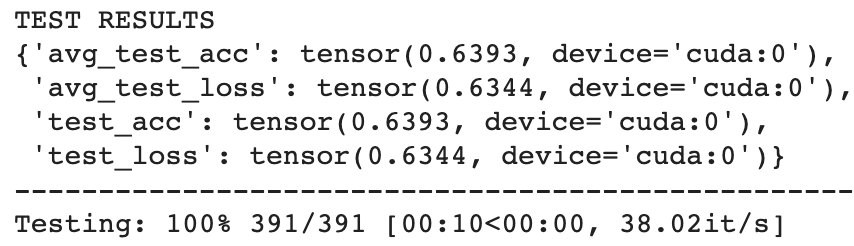
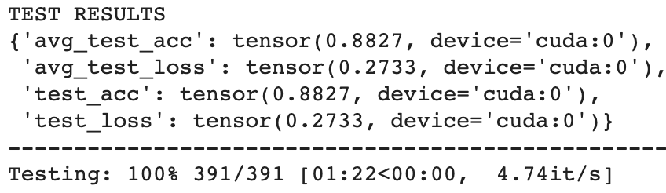
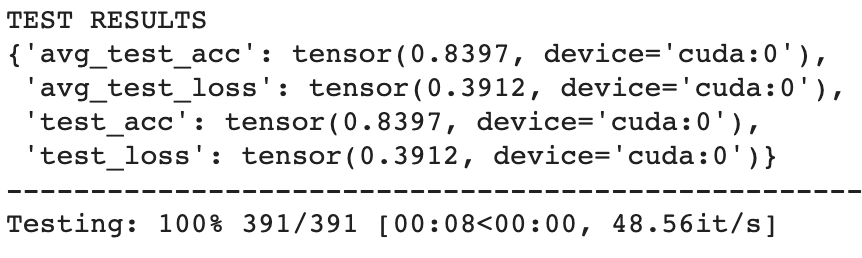
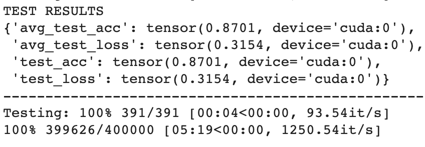

# Sentiment Analysis
Sentiment Analysis using Pytorch-Lightning

This is **heavily** inspired by Ben Trevett's 
[work](https://github.com/bentrevett/pytorch-sentiment-analysis). I made this 
so that it becomes easier for people who are new to NLP and pytorch-lightning, 
to get them going with a very basic framework to get started.

With this, you can
1. Train popular architectures to according to your hyper-parameters 
(on IMDb dataset for now, planning to extend)
2. Train your own architecture. (Instructions on how this can be done will be 
added soon)
3. Use one of the pre-trained model, to just get the sentiment prediction of the
 popular models.

## List of pre-trained models available
### 1. Simple RNN Classifier
**Test Results**

**Description**

The results are not very great considering that it is a binary classification 
problem. It was added a baseline comparison, to see how well does the naïve 
architecture perform on this dataset. Although it is decently fast, it is not
the fastest. Consider using other architectures for getting good predictions.
### 2. Bi-Directinal LSTM Classifier


**Description**

The **best** architecture in terms of test accuracy. In the further manual 
checking done, the results were decent. It is extremely slow, in fact it is
the **slowest** model of all the available options in this repository. This 
model will be on the 17th place on 
[IMDb Benchmark](https://paperswithcode.com/sota/sentiment-analysis-on-imdb)
leaderboard. That is really good for a model trained for less than an hour on 
Google Colab GPU.
### 3. Fast Classifier


**Description**

This model architecture strikes a perfect balance of speed and accuracy. This
is the default model in all the scripts. This can be considered go to model 
architecture, when you want to do any sentiment-analysis task. In the further
manual testing, the results were sensible "most" of the time.

### 4. CNN Classifier


**Description**

This model architecture has a great balance of speed and accuracy. This
is a super fast model. This is the **fastest** model on this library. If you
observe closely, this model is better in accuracy than *Fast Classifier* and
also faster than it. But this is not the default model, because this model 
needs a sentence at least 3 words long to work. If this is handled, this is 
the best possible option overall for sentiment analysis task. It is not far
behind the *BiLSTM Classifier*, just 1.3% shy. On the 
[IMDb Benchmark](https://paperswithcode.com/sota/sentiment-analysis-on-imdb)
it will be on 19th place, the training took less than 10 minutes.

## How to train new models with available architectures
This will give a list of all the hyper-parameters you can tweak to check and 
have fun.
```
python train.py --help
```

## How to add your new architectures
We have added a comprehensive guide to add your own architectures 
[here](/Adding%20New%20Model.md). If you liked the model you developed and want
to share, the pull requests are open. :)

### DEFAULTS
1. **Architecture:** Average Pooling over embeddings and a linear classifier 
over it. This model was introduced by the paper 
[Bag of Tricks for Efficient Text Classification](https://arxiv.org/abs/1607.01759). 
Our implementation is almost verbatim from [bentrevett](https://github.com/bentrevett/pytorch-sentiment-analysis)
2. **Optimizer:** Adam with 1e-3 learning rate.
3. **Device**: The code by default assumes that you are using CPU. To ue a GPU
, you have to run with the flag --n_gpus=1, if you are using a GPU we suggest 
to use a batch size of 64.
